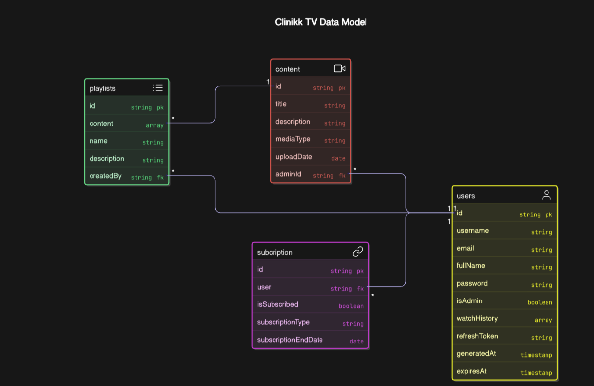

# Clinikk-TV Backend

This is the backend for Clinikk-TV, a content streaming platform providing access to rich, health-related media content, which can include both video and audio. It provides user authentication, content management, playlist management, and subscription functionalities.

## Features
- User authentication (Registration, Login, Logout)
- Password update and account management
- Content upload and management with Cloudinary storage by Admin only
- Watch history tracking
- Subscription-based content access
- Playlist creation and management by User and Admin
- Admin-specific functionalities

🚀 Additional Features

Admin Authentication: Admins must register using an employee ID.

Limited Access for Unsubscribed Users: Unsubscribed users have restricted access to premium content.

Live streaming support for real-time events.

Comment & Review System to engage users.

---
## 📂 Project Structure

```
Clinikk-TV-backend/
│── node_modules/
│── public/
│── src/
│   ├── controllers/       # Contains route controllers
│   ├── db/                # Database connection files
│   ├── middlewares/       # Authentication and other middlewares
│   ├── models/            # Mongoose models for database schema
│   ├── routes/            # Express routes for API endpoints
│   ├── utils/             # Utility functions
│   ├── app.js             # Express app setup
│   ├── constants.js       # App-wide constants
│   ├── index.js           # Entry point of the application
│── .env.sample            # Sample environment variables file
│── .gitignore             # Ignored files configuration
│── package.json           # Dependencies and scripts
```

---

## 🏗️ Database Model



---

## Installation

1. Clone the repository:
   ```sh
   git clone [https://github.com/your-repo/Clinikk-TV-backend.git](https://github.com/KIRANBADAKURAVA/Clinikk-TV-backend.git)
   cd Clinikk-TV-backend
   ```

2. Install dependencies:
   ```sh
   npm install
   ```

3. Set up environment variables:
   - Rename `env.sample` to `.env`
   - Configure the required environment variables inside `.env`

4. Start the server:
   ```sh
   npm run dev
   ```
   The server will start on `http://localhost:9000`

---

## Environment Variables

| Variable Name            | Description                                  |
|--------------------------|----------------------------------------------|
| `MONGO_URI`             | MongoDB connection string                   |
| `FRONTEND_URL`          | To avoid CORS error                   |
| `ACCESS_TOKEN_SECRET`   | Secret key for JWT access tokens             |
| `REFRESH_TOKEN_SECRET`  | Secret key for JWT refresh tokens            |
| `ACCESS_TOKEN_EXPIRY`   | Expiry time for access tokens                |
| `REFRESH_TOKEN_EXPIRY`  | Expiry time for refresh tokens               |
| `CLOUDINARY_CLOUD_NAME` | Cloudinary cloud name                        |
| `CLOUDINARY_API_KEY`    | Cloudinary API key                           |
| `CLOUDINARY_API_SECRET` | Cloudinary API secret                        |

---

## API Endpoints

### **User Routes**

| Method | Endpoint               | Description                          | Authentication Required |
|--------|------------------------|--------------------------------------|-------------------------|
| POST   | `/api/user/register`   | Register a new user                 | No                      |
| POST   | `/api/user/login`      | Login a user                         | No                      |
| POST   | `/api/user/logout`     | Logout a user                        | Yes                     |
| PUT    | `/api/user/updatepassword` | Update user password           | Yes                     |
| GET    | `/api/user/getuser`    | Get current user details             | Yes                     |
| PATCH  | `/api/user/updateprofile` | Update user profile details     | Yes                     |
| GET    | `/api/user/watchhistory` | Get user watch history           | Yes                     |

### **Subscription Routes**

| Method | Endpoint                    | Description                  | Authentication Required |
|--------|-----------------------------|------------------------------|-------------------------|
| POST   | `/api/user/toggleSubscription` | Toggle user subscription status | Yes                     |

### **Content Routes**

| Method | Endpoint                 | Description                     | Authentication Required |
|--------|--------------------------|---------------------------------|-------------------------|
| POST   | `/api/content/uploadcontent` | Upload new content           | Yes (Admin)             |
| GET    | `/api/content/getallcontent` | Fetch all content            | No                      |
| GET    | `/api/content/:id`        | Get content by ID              | No                      |
| DELETE | `/api/content/:id`        | Delete content                 | Yes (Admin)             |

### **Playlist Routes**

| Method | Endpoint                  | Description                  | Authentication Required |
|--------|---------------------------|------------------------------|-------------------------|
| POST   | `/api/playlist/create`    | Create a new playlist        | Yes                     |
| PUT    | `/api/playlist/addcontent/:id` | Add content to playlist | Yes                     |

### **Admin Routes**

| Method | Endpoint                | Description                  | Authentication Required |
|--------|-------------------------|------------------------------|-------------------------|
| DELETE | `/api/content/:id`      | Delete any content           | Yes (Admin)             |
| PUT    | `/api/user/updateRole`  | Update user role             | Yes (Admin)             |

---

## Cloudinary Integration
Content files are stored using [Cloudinary](https://cloudinary.com/). Ensure you have set up Cloudinary credentials in your `.env` file.

---


## Contributing
Feel free to submit issues and pull requests to improve this project!

